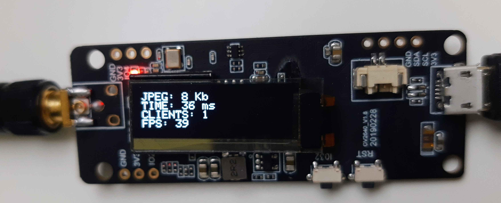
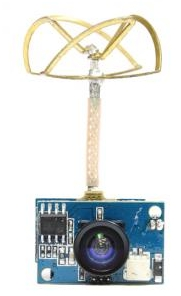
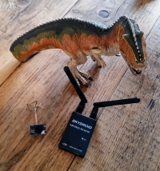
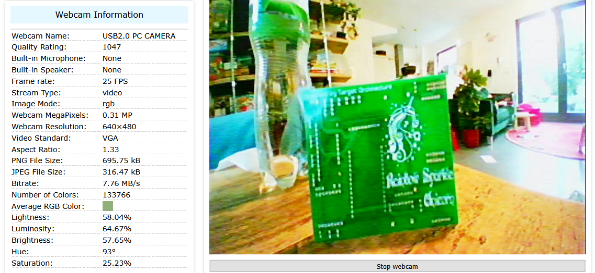
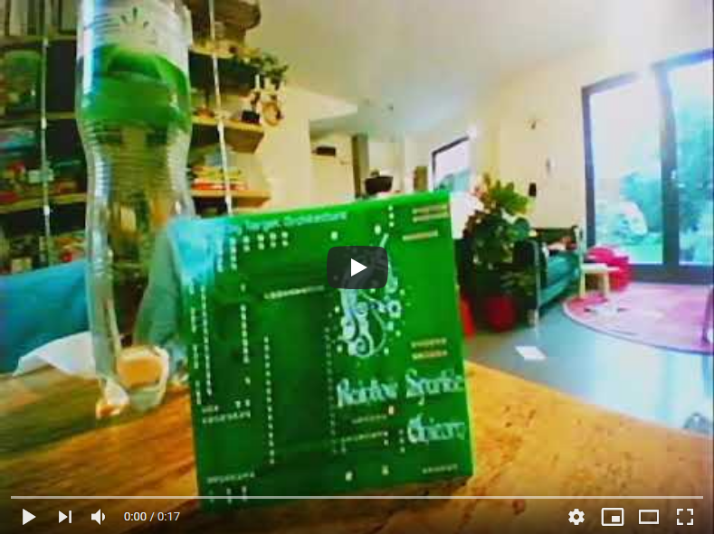
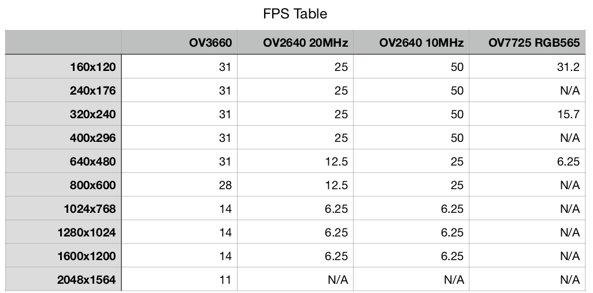
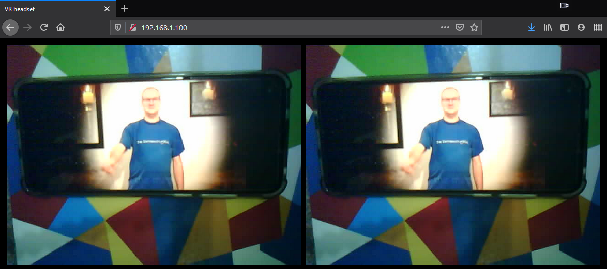
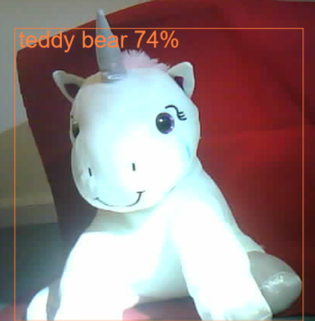
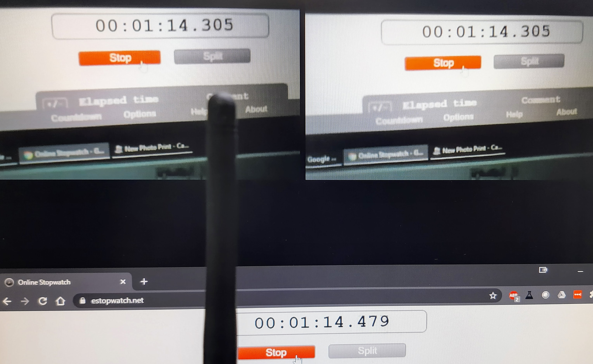
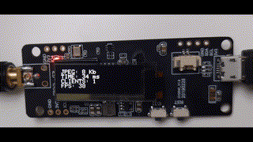

# Highlights

* Uses ESP32-PICO TTGO T-Journal board 
* Requires no PSRAM
* Onboard OLED display of performance and statistics
* Low latency of 15-35 milliseconds to complete the loop() method
* Average frame rates of 25 FPS 
* VGA dimension JPEG suitable for COCO-SSD model
* Multi-client video feed using WebSockets
* Publishing of JPEG frames to an MQTT broker
* HTTP server serving flash based HTML files (no SPIFFS)
* HTML page for VR goggle display
* HTML page for full-screen display
* HTML page for object detection using ML5.js and the COCO-SSD model 



# Background

Since building a few drivable robots I have wanted to have a FPV solution to allow Ada to “see” what the robot is seeing. Ada regularly uses a mobile phone VR headset to watch the 360 degrees YouTube channel and most recently the David Blane “Ascension” stunt (https://www.youtube.com/watch?v=R6WyUlvHKAE).

I bought an ESP32Cam in mid-2019 and tried the pre-installed demo. I wasn’t impressed with the results , there was too much latency and it got very hot. So it went in the drawer with the other bits and pieces I’ve purchased on AliExpress and never used.

Fast forward to October 2020, with time on my hands due to the pandemic curtailing a lot of social activities I started to think about the FPV problem again. 

# Drone Camera vs Web Camera FPV

I had watched a few FPV drone videos and purchased a small FPV camera from a UK company (https://www.flyingtech.co.uk/), this helped me make sure it was a legal transmitter at 25mW. The camera works at 5.8Ghz and has 1200TVL (TV lines) which claims to have effective image size 1280Hx1024V. This is about as good as it gets for analog cameras. Paired with a USB OTG UVC (Universal Video Class) 5.8Ghz receiver allowed the image to be displayed on a mobile phone or Windows 10. 

   

These devices typically have a latency of 85ms to 100ms (http://www.youtube.com/watch?v=pd8fyUSd1p8), for my purposes this latency would be adequate for a robot driving around. These small and low cost FPV drone cameras can be powered, with voltages that are commonplace in microprocessor projects (3.3-5.5V). 

After trying this camera for a few days I found the quality of the image is quite poor, and does not seem to be as good as the images that I had seen on my ESP32Cam with its OV2640. I used a webcam test site to get more details about the performance of the camera.



However the frame rate is impressive displaying a VGA output being available in the FPV Android App I used.These devices output a VGA resolution of 640H480V which sounded low to me at the beginning of this project. I'm not going to give up on  FPV drone cameras. However, I thought there might be a better way and decided to dust off my ESP32cam.

[](http://www.youtube.com/watch?v=bJKlJWKc6aE)

However I soon found another blocker with poor WIFI signal on the ESP32Cam,  although it's not envisaged that the robot will be travelling very far from the Wifi base station. I found that the quality of the signal drops off very quickly when going between the floors of the house. 

# TTGO T-Journal camera board

So I decided to buy a TTGO T-Journal as it has many useful features including big antenna, OLED display, CP2104 USB programmer. However the ESP32-PICO-D4 package does not have as much memory (no PSRAM) as the ESP32Cam board (https://www.espressif.com/sites/default/files/documentation/esp32-pico-d4_datasheet_en.pdf). 

If you google ESP32CAM you find lots of examples , feedback and articles are all based on people's desire to have high resolution and high frame rates. A quick review of specifications of the OV2640 cameras show that these combinations are not achievable. So a lower resolution of VGA is required to get 25 frames per second. I was initially concerned that VGA resolution was too small , however the COCO-SSD object detection model takes images of 300x300 pixels (https://www.tensorflow.org/lite/models/object_detection/overview#input) so the frame size becomes less of an issue.

I needed to improve the FPS speed to at 25 frames per second, a common solution is to alter the camera’s clock speed from 20Mhz to 10Mhz, this is achieved by setting xclk_freq_hz = 10000000. This change allows two frame buffers to be used and this gives the camera hardware enough time to process at 25 FPS which is the same as the FPV camera. I experimented with different JPEG quality settings and found that 15 was the highest setting the ESP32-PICO could handle without crashing on an out of memory error. I found this table showing the differant framerates and settings that are achievable.



The project is aiming to provide a camera solution which can FPV both to a mobile phone for use with Google Cardboard and as well as providing a mechanism to supply a stream of images to a machine learning platform. The TTGO T-Journal should allow the solution to be achievable.

With the frame rate problem solved I looked at how everyone else and the Arduino example have built their code, most are using M-JPEG over HTTP (https://en.wikipedia.org/wiki/Motion_JPEG#M-JPEG_over_HTTP) a technology which started in the mid-1990’s. The basic web server code has a blocking loop and so only one client can connect at the same time . Looking at the multi-client solutions involves a lot of complex code to make the dual cores work and the real limitation is the requirement for more than 4Mb of memory (with the ESP32Cam having additional PSRAM). I also looked at solutions using RTSP (https://en.wikipedia.org/wiki/Real_Time_Streaming_Protocol) and again found similar issues where only one client could connect to view the video. 

# Using Websockets to serve JPEG frames

Technology has moved on since MJPEG and in 2011 the WebSocket protocol was ratified. WebSocket is much lighter than HTTP and is designed for fast small messages primarily for communication. I found some libraries on GitHub for a WebSocket implementation and this looked a lot simpler as it could support multiple clients and run in the loop() method of the code. 

```cpp
  //broadcast to all connected clients
  webSocket.broadcastBIN(fb->buf, fb_len);
```

Running all of the code in the loop() method allows the same image to be used across all connected devices and without any multi-core threading there is no need for a semaphore flag approach to understand when the camera is finished saving a frame.

# Using MQTT to serve JPEG frames

To allow edge or cloud based AI image processing , I opted to use MQTT (https://en.wikipedia.org/wiki/MQTT) using a library I had used before (https://github.com/knolleary/pubsubclient). To quickly prototype the solution I used the Shiftr.io MQTT platform (https://shiftr.io/shiftr-io/demo) and simultaneously streaming to my phones browser and desktop browser and I have been impressed with the timings, considering is a cloud based platform.


The code includes some a timing mechanism which prints out to the serial port as well as to the OLED display. The timings show that in even serving three WebSocket clients and sending the JPEG images in a MQTT message to the internet based Shiftr.io platform the entire loop is completed with 50 milliseconds.

The code is almost completely stripped down to only serve the streaming and performance functions, in my opinion there is little reason for running machine learning on these boards as the models are too slow or lacking in features to make them useful for robotics. Making the JPEG frames available over MQTT allows the images to be processed by a platform with more processing power such as a RaspberryPi or Jetson Nano. The predictions can then be sent to the display or robot via MQTT to take appropriate action.

One of the issues I encountered when using the MQTT library was the default message size is only set to 128 characters, this is not enough to send an entire JPEG image, which can range in size depending on the complexity of the image from 8kb (face down on desk) up to 25 kilobytes when viewing movement in a room. To overcome this I have set the buffer size to 30,000. This seems adequate to store the level of detail at a JPEG image of the size it could capture and some overhead for the messaging.

```cpp 
    MQTTClient.setBufferSize(30000);
``` 

You can see the image size in the developer mode of your browser when viewing the WebSocket network activity.

# HTTP server

The last piece of the code works remarkably simply when using the PlatformIO IDE when compared to attempting the same thing in the Arduino IDE. The goal is to serve the HTML needed for viewing the video feed using WebSockets. 



Most examples I have seen use SPIFFs, however these take up more memory and structure on the ROM. I opted to embed the HTML file as a variable (https://docs.platformio.org/en/latest/platforms/espressif32.html#embedding-binary-data), PlatformIO makes this process so simple and the file is automatically updated each build and deploy.just by adding this command to the platformio.ini file.

```cpp 
  board_build.embed_txtfiles =
    www/vr.html
    www/cocossd.html
    www/fullscreen.html
``` 

When the file is requested at the board’s IP address ,ie: http://192.168.1.100/ the HTML is obtained from the .rodate section of flash. The code contains two templated variables that need to replaced, as the HTML doesn’t know the IP address in advance.

```cpp
    function configWebSocket() {
        var server = 'ws://{{IP}}:{{PORT}}';
        var socket = new WebSocket(server);
        socket.binaryType = 'arraybuffer';
```

A small regular expression is used to find and replace these variables, allowing the code to be more portable.

```cpp
    //embedded files
    extern const uint8_t vrHTML_start[] asm("_binary_www_vr_html_start");
    extern const uint8_t vrHTML_end[] asm("_binary_www_vr_html_end");
    
    void handleRoot()
    {
    auto html = (const char *)vrHTML_start;
    
    auto resolved = std::regex_replace(html, std::regex("\\{\\{IP\\}\\}"), WiFi.localIP().toString().c_str());
    
    auto port = (String)webSocketPort;
    
    resolved = std::regex_replace(resolved, std::regex("\\{\\{PORT\\}\\}"), port.c_str());
    
    server.send(200, "text/html", resolved.c_str());
    }
```
The HTTP server has three pages it can serve

<table>
<tr>
    <td>http://{{IP}}/ </td>
    <td>Dual screen VR headset page</td>
</tr>
<tr>
    <td>http://{{IP}}/fullscreen</td>
    <td>Full screen display, allowing F11 to show full screen</td>
</tr>
<tr>
    <td>http://{{IP}}/cocossd</td>
    <td>Displays a single video area with COCO-SSD object detection</td>
</tr>
</table>

# Browser based object detection using COCO-SSD

Early in 2020 I learnt about Machine Learning (a branch of Artifical Intelligence) and built a "magic wand" that is combined with a browser based Convolutional neural network (CNN), see my YouTube video for a quick overview https://www.youtube.com/watch?v=jUrRhjOwJZk . The approach of performing image processing away from the ESP32 is contradictory to a lot of projects, however I have tried many of them and found the ESP32 is not powerful enough to give satisfactory results and is harder to update.

Using the ML5.js library which is referenced in the HTML and the video frame stream from the websockets I am achieving a high frame rate (although it helps I using a i7-10875H).

To help with timing issues the COCO-SSD is only given the detection instruction when the image frame has been fully recieved via the WebSocket.

```javascript
    socket.onmessage = async function (msg) {
      var bytes = new Uint8Array(msg.data);
      var binary = '';
      var len = bytes.byteLength;
      for (var i = 0; i < len; i++) {
        binary += String.fromCharCode(bytes[i])
      }

      var img = new Image();
      img.src = 'data:image/jpg;base64,' + window.btoa(binary);

      img.onload = function () {
        ctx.drawImage(img, 0, 0, canvas.width, canvas.height);

        detector.detect(img, gotResults);
      };
    }
```
ML5.js is a great way to start using Machine Learning as entire pre-trained models can be loaded in a single line of code

```javascript
   detector = ml5.objectDetector('cocossd', modelReady);
```

The results are ok, considering this is running in browser using the small COCO-SSD model





# Latency testing

Latency for the system is the lag between the camera seeing an image and it being visible in the VR headset. For the latency checks it is worth noting that the code is also transmitting the JPEG frame to a local MQTT broker running on RaspberryPi Zero W. The latency of the system was measured at around 175 milliseconds, for a drone this is too long, however for a robot travelling at one mile per hour it’s not important.



I ran the latency tests using the VR page on my desktop browser to show WebSocket streaming speed




# Code improvements

If you don't need to use the MQTT functionality this can be disabled be commenting out the

```cpp
  #define USE_MQTT
```

Further improvements to the code include disabling the onboard Bluetooth and disabling the brown out detector.

```cpp
  //disable brownout detector
  WRITE_PERI_REG(RTC_CNTL_BROWN_OUT_REG, 0);
 
  //turn off bluetooth
  btStop();
```

I’m sure the code could be optimised further ,especially as it uses the large Adafruit Graphics Library (https://github.com/adafruit/Adafruit-GFX-Library).

# Conclusion

A great ESP32 based board which despite it's small amount of RAM can be made to perform at a high frame rate. It's interesting to see the frame rates rise and fall as the complexity of the camera image changes the frame size. The use of multiple communication methods allows the FPV googles and edge-based AI to be blended together.I'm looking forward to using this solution as the basis for future computer vision projects. 